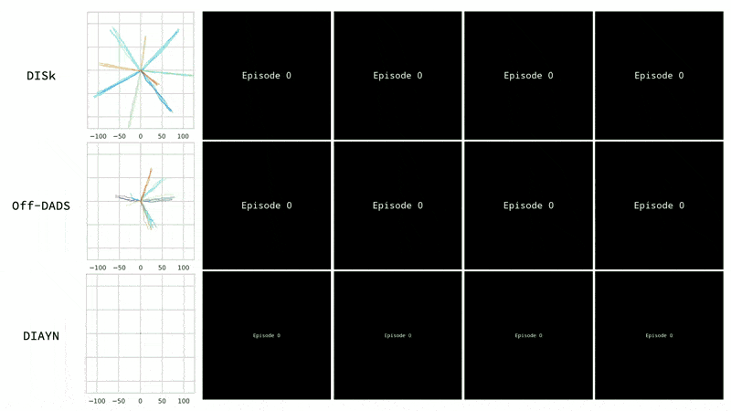
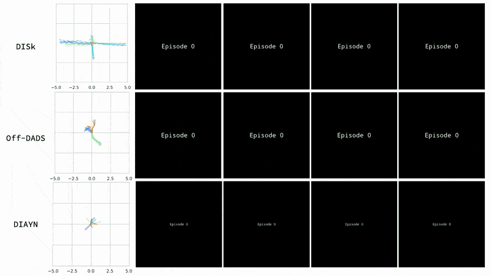

# Discovering Incremental Skills (DISk) implementation in PyTorch

This is PyTorch implementation of Discovering Incremental Skills (DISk) [[OpenReview]](https://openreview.net/forum?id=dg79moSRqIo) [[Presentation]](https://www.youtube.com/watch?v=ALu21MQDWPc) [[Website]](https://notmahi.github.io/disk/) [[Arxiv]](https://arxiv.org/abs/2203.11176).

If you use this code in your research project please cite us as:
```
@inproceedings{shafiullah2021one,
  title={One After Another: Learning Incremental Skills for a Changing World},
  author={Shafiullah, Nur Muhammad Mahi and Pinto, Lerrel},
  booktitle={International Conference on Learning Representations},
  year={2021}
}
```

## Requirements
We assume you have access to a gpu that can run CUDA 11.3. Then, the simplest way to install all required dependencies is to create an anaconda environment and activate it:

```
conda env create -f conda_env.yml
conda activate disk
```

Unfortunately, our experiments require you to install MuJoCo version 1.50 because of a [bug in OpenAI Gym MuJoCo environments](https://github.com/openai/gym/issues/1541). You can download the older MuJoCo version and use a free license key, all from [here](https://roboti.us/).

## Instructions
To train an SAC agent on the `Ant-v3` task run:
```
python train.py env=ant
```

This will produce `exp` folder, where all the outputs are going to be stored including train/eval logs, and evaluation episode videos. Some data will also be stores in [Weights and Biases](https://wandb.ai) for further analysis.

## Results


A video is worth a thousand figures, so here you go.

### Ant


### Swimmer


### Cheetah

